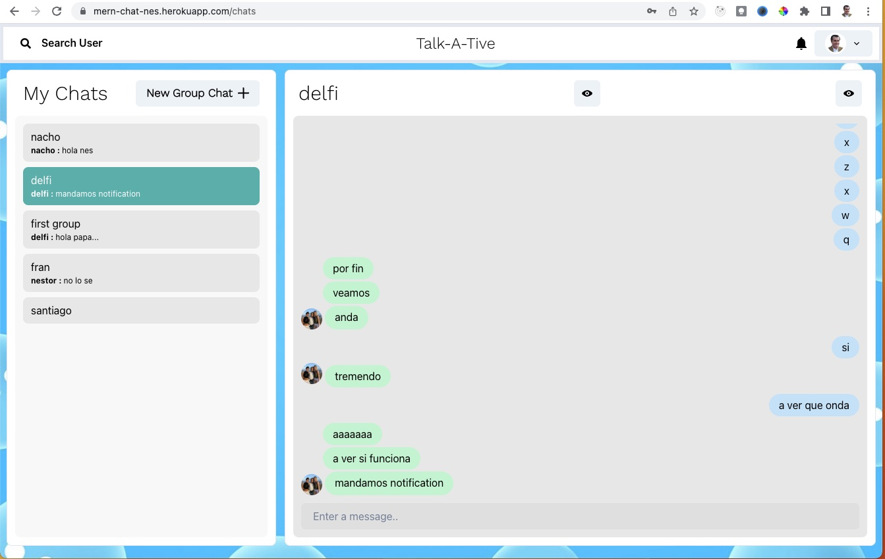
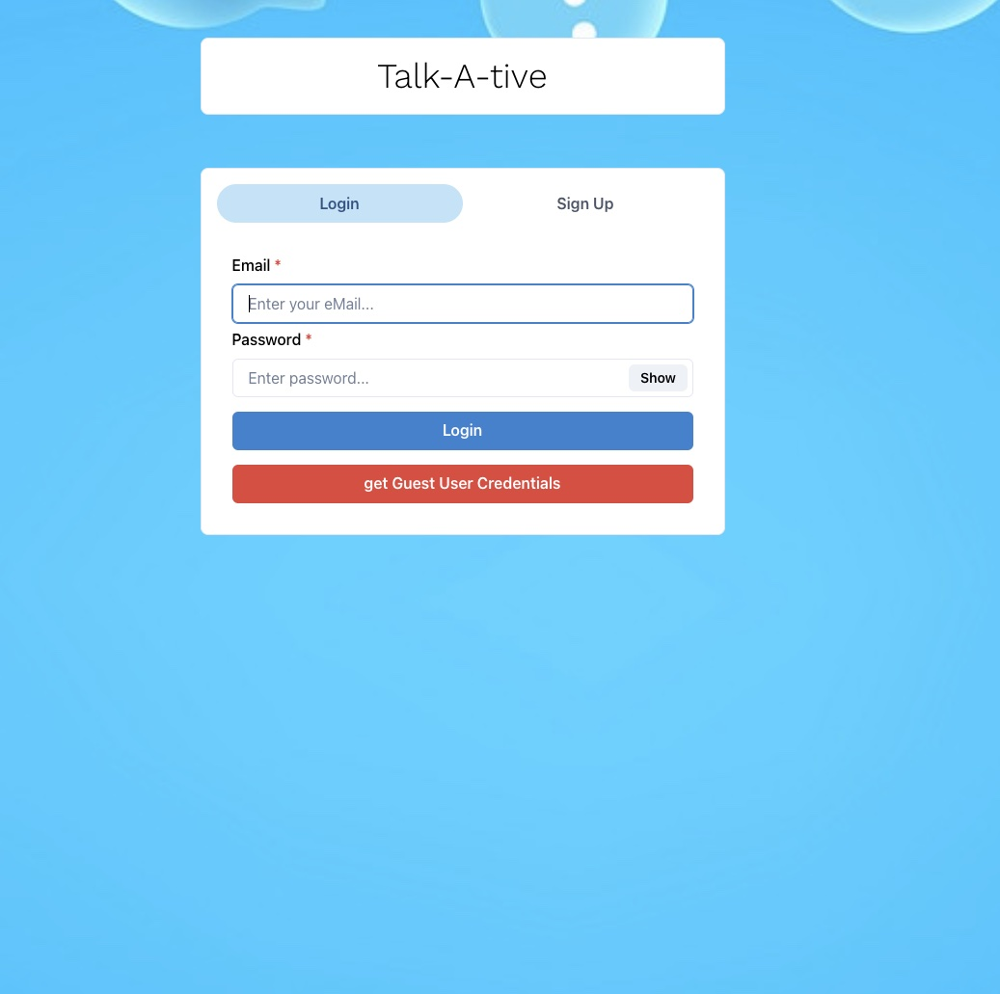
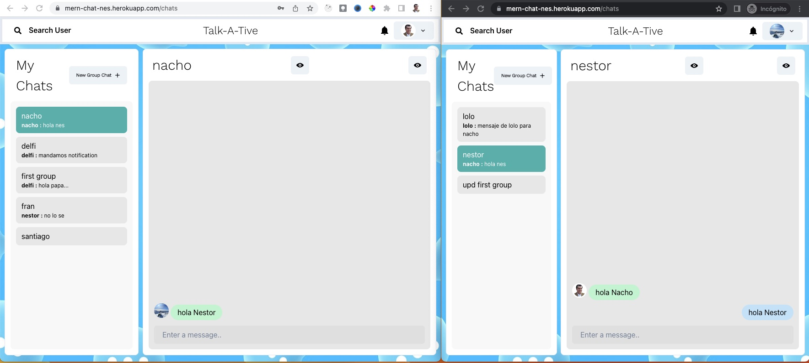
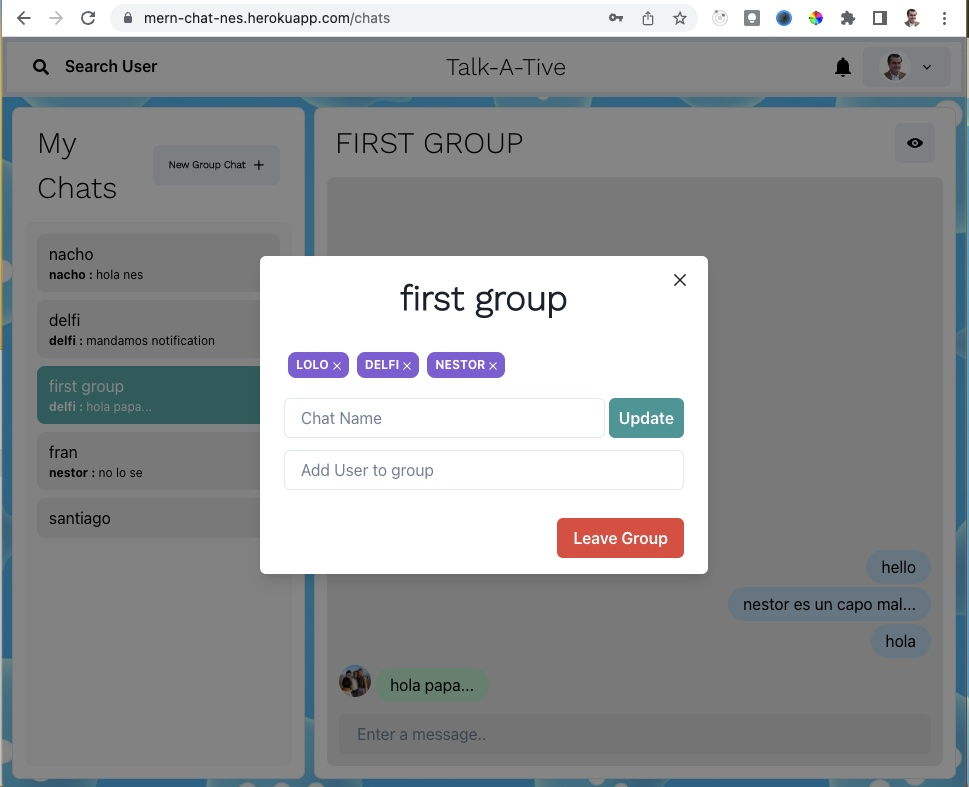
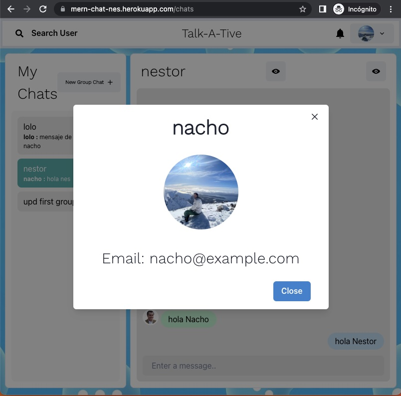
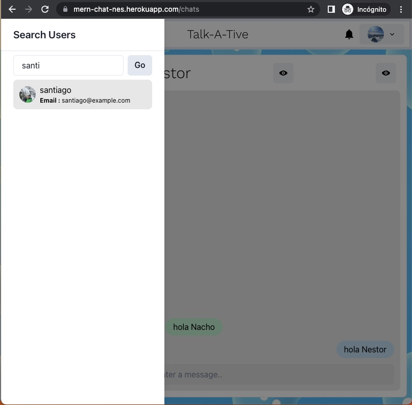

# Chat app

Aplicación real-time chat desarrollada con React, MongoDB, Mongoose y Node.js. Los mensajes real-time son manejados por un servidor Web Socket, constuido con la librería Socket.io

La aplicación tiene salas grupales de chat, asi como la posibilidad de establecer mensajes privados entre dos usuario.

Los procesos de autenticación y autorización son con JWT.

Esta aplicación fue desarrollada siguiendo el curso de RoadsideCoder en Youtube: https://www.youtube.com/watch?v=3vRcB0P84t4. Probablemente el mejor curso online sobre real-time applications

La aplicación está deployada en: https://mern-chat-nes.herokuapp.com/

